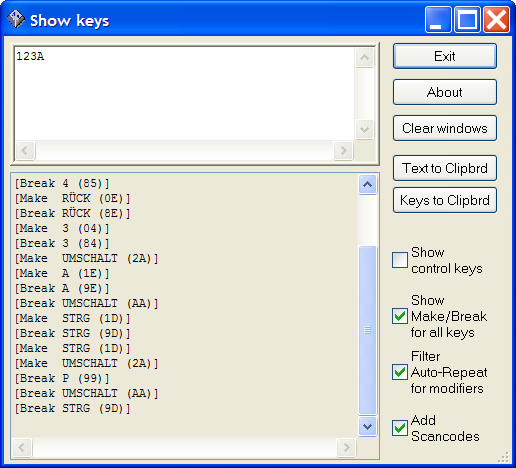

Showkeys
========

is a tool to see details about keystrokes.

### 

### Installation

There is no installation program required, just unzip and copy it to a
place of your choice.

### Contents of the download file

- Showkeys.exe
- Readme.txt
