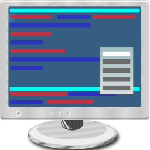

Yat3
====

is a terminal program specially suited to communicate with embedded
devices.

### Features

- Buttons can be configured with strings to send.
- "Unlimited" set of Buttons.
- Buttonsets can be exported/imported.
- Command center allows to send ad hoc strings (with pre/suffix automatically added).
- Hex view window.
- Handles unplug/replug of USB devices nicely.
- Supports more than just ComPorts: HidPos, other similar interfaces often used by barcode scanners.

### [Screenshots](Screenshots.html)

### Installation

There is no installation program required, just unzip and copy it to a
place of your choice.

### Contents of the download file

- Yat3.exe The tool itself.
- Tutorial.pdf A tutorial how to use it.
- errata.txt Known issues.
- CommandCenter.yas Example for setting up command center.
- ButtonExamples This directory contains more examples for the programmable buttons.
